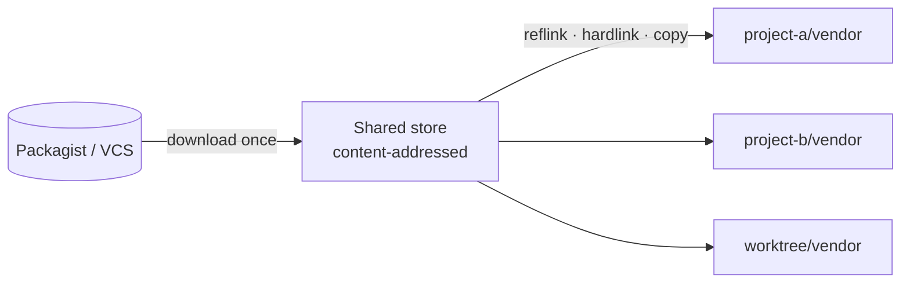

<p align="center">
  <picture>
    <source media="(prefers-color-scheme: dark)" srcset="docs/assets/maestro-dark.svg">
    
  </picture>
</p>

<h1 align="center">maestro</h1>

<p align="center">
  <strong>Composer, natively.</strong><br>
  A drop-in replacement for <code>composer</code>, written in Go.
</p>

<p align="center">
  <a href="https://github.com/stubbedev/maestro/actions/workflows/ci.yml"></a>
  <a href="https://github.com/stubbedev/maestro/releases"></a>
  <a href="LICENSE"></a>
</p>

<p align="center">
  <a href="#install">Install</a> ·
  <a href="#usage">Usage</a> ·
  <a href="#guarantees">Guarantees</a> ·
  <a href="#performance">Performance</a> ·
  <a href="#configuration">Configuration</a> ·
  <a href="#development">Development</a>
</p>

---

maestro is a line-by-line port of [Composer](https://getcomposer.org) to Go.
Anything that reads what Composer produces gets the same thing from maestro,
byte for byte, and gets it several times faster. It never runs or ships
`composer.phar`.

|   |   |
|---|---|
| **Drop-in compatible** | Same commands, options, exit codes, prompts, scripts, events and machine-readable output. Same `composer.json`, `composer.lock` and `vendor/` on disk. |
| **Shared package store** | Every release is extracted once per machine and imported into `vendor/` by reflink, hardlink or copy, the way pnpm does it. A second project or git worktree installs without downloading or unzipping anything. |
| **Native speed** | Resolution, extraction, autoload dumping and metadata handling run in Go, in parallel wherever the result stays identical. |
| **Plugins run unchanged** | An embedded PHP layer provides Composer's public plugin API on top of maestro's own state. |
| **Self-contained** | zip, tar, gz, bz2 and xz are handled natively. No `unzip` or `tar` needed. |

## Install

**Homebrew** (macOS, Linux)

```sh
brew install stubbedev/tap/maestro
```

The formula uses the `php` already on your `PATH`. Add `--with-php` if you
don't have one. On Apple Silicon, use the arm64 Homebrew
(`/opt/homebrew/bin/brew`).

**Install script** (Linux, macOS, FreeBSD)

```sh
curl -fsSL https://raw.githubusercontent.com/stubbedev/maestro/main/install.sh | sh
```

The script picks the binary for your hardware, checks it against the
release's `checksums.txt` and installs it to `~/.local/bin`. Set
`MAESTRO_INSTALL_DIR` to install somewhere else, or `MAESTRO_VERSION` to
pin a release tag.

**Nix**

```nix
# flake.nix
inputs.maestro.url = "github:stubbedev/maestro";
# then add inputs.maestro.packages.${system}.default to your packages
```

The Nix package also provides a `composer` command.

**Prebuilt binaries** for Linux, macOS, Windows and FreeBSD are attached to
every [release](https://github.com/stubbedev/maestro/releases), together
with a `checksums.txt`.

## Usage

Use maestro exactly as you would use Composer:

```sh
maestro install
maestro require symfony/console
maestro update --dry-run
maestro dump-autoload -o
```

To have existing tooling, CI scripts and IDEs pick it up as `composer`,
link it onto your `PATH` (the Nix package does this for you):

```sh
ln -s "$(command -v maestro)" ~/.local/bin/composer
```

`maestro self-update` keeps the binary current.

maestro calls `php` only where Composer itself runs PHP code for your
project: scripts, plugins, platform detection and `exec`.

### How installs work



A package is downloaded and extracted once per machine. Every later install
of that release, in any project, is a file-system import from the store.

## Guarantees

maestro tracks Composer's current release. Everything that tools and
scripts depend on is identical to Composer's:

- commands, options and exit codes
- machine-readable output (`--format=json`, `show`, `outdated`, `audit`, ...)
- interactive questions and their defaults
- scripts and events, including their environment and exit codes
- every file written: `composer.json`, `composer.lock`, `vendor/composer/*`,
  the `vendor/bin` proxies and the installed packages

Human-facing output (errors, warnings and progress) is presented in
maestro's own style.

**How this is verified**

maestro's test suite goes well beyond the one it was ported from: close to
3,000 Go tests, built in layers.

- **Composer's own tests.** Every PHPUnit test that covers a ported class
  is ported with all of its data-provider cases, and Composer's fixtures
  (every installer fixture among them) are used verbatim.
- **Differential oracles.** Goldens generated by running Composer's real PHP
  code check the version parser, the resolver, autoload, the class map,
  JSON, config, repositories and more against the PHP implementation.
- **Error oracle.** More than 400 failure scenarios (bad arguments, invalid
  manifests, unmet preconditions) compare maestro's exit codes, stdout and
  error messages with Composer's.
- **Every command, both ways.** A guard test fails the build unless every
  command, alias and hidden command has at least one positive and one
  negative test.
- **End to end.** Real Composer and maestro run side by side on the same
  projects (Laravel, Symfony and a large private application among them),
  on Linux and Windows, and their output, lock files and `vendor/` trees
  are compared byte for byte.
- **Archives and the store.** Extraction is checked against Info-ZIP
  `unzip` and GNU `tar` on real-world dists, and the store's system-call
  cost per file is held to a budget.
- **Every platform.** CI runs the suite on Linux, macOS and Windows.
- **Plugins.** The plugin runtime is tested against the real packages, among them
  composer/installers, pestphp/pest-plugin,
  dealerdirect/phpcodesniffer-composer-installer,
  wikimedia/composer-merge-plugin, cweagans/composer-patches,
  ergebnis/composer-normalize, Drupal's scaffold and Laravel's package
  discovery. See [docs/PLUGINS.md](docs/PLUGINS.md).

**Where maestro differs on purpose**

- Packages are imported from the shared store, so file modification times
  in `vendor/` are not the archive's, and hard-linked files are shared
  between projects. Plugin packages are never hard-linked.
- `self-update` updates maestro.
- `--version` adds a `Maestro version` line on stderr, and the `list`
  banner names maestro.

[docs/PORTING.md](docs/PORTING.md#the-contract) defines the full contract
and lists every
[deliberate deviation](docs/PORTING.md#deliberate-deviations).

## Performance

Typical speed-ups over Composer on a locked `laravel/laravel` project:

| Command | Speed-up |
|---|---:|
| `install`, cold caches | ~3x |
| `install`, warm store (new project or worktree) | ~9x |
| `install`, nothing to do | ~16x |
| `update --dry-run` | ~6–10x |
| `dump-autoload -o` | ~35x |

The method, the full results for every project and where the time goes are
in [docs/BENCHMARKS.md](docs/BENCHMARKS.md).

## Configuration

maestro reads all of Composer's configuration and environment variables.
It adds the following:

| Variable | Default | Purpose |
|---|---|---|
| `MAESTRO_CACHE_DIR` | `$XDG_CACHE_HOME/maestro`, else the platform cache directory | Location of the package store and maestro's other caches |
| `MAESTRO_PACKAGE_IMPORT_METHOD` | reflink, else hardlink, else copy | Force `clone`, `hardlink` or `copy` when importing from the store |

`maestro clear-cache` clears maestro's caches along with Composer's.

## Development

The dev environment is [devenv](https://devenv.sh): `devenv shell` provides
Go, golangci-lint, php, unzip and the rest. `ref-sync` checks out the
Composer sources being ported into `.ref/`. Tests, vet and lint run in a
Docker dev container (`compose.yaml`), driven by the justfile:

```sh
just check       # every gate CI runs: vet, lint, deadcode, tidy-check, test, build
just test        # the test suite, php-driven tests included (args go to go test)
just test-race   # race detector, plus the php-driven tests
just e2e         # compare against the real Composer (network, slow)
just shell       # a shell in the dev container
```

| Document | Covers |
|---|---|
| [docs/PORTING.md](docs/PORTING.md) | The porting contract: what must match Composer, the layout, the rules every port follows and how tests are ported |
| [docs/PLUGINS.md](docs/PLUGINS.md) | The plugin runtime |
| [docs/BENCHMARKS.md](docs/BENCHMARKS.md) | Benchmark method and results |

## License

MIT. maestro is a port of Composer and embeds some of its files; see
[LICENSE](LICENSE).
